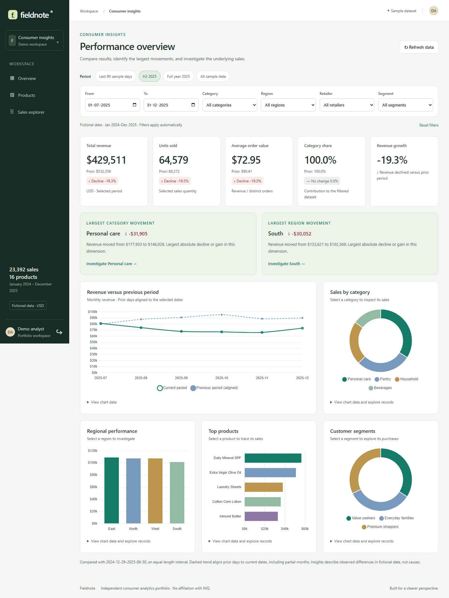

# Consumer Insights Analytics Dashboard

**Fieldnote** is an independent, full-stack consumer analytics portfolio application. It turns fictional retail transactions into an interactive dashboard, product portfolio, and searchable sales explorer.
Built to demonstrate maintainable frontend engineering and backend integration. This portfolio uses fictional data and production-oriented engineering practices.

## Overview

- **23,392** reproducible fictional order lines across **16 products**, **4 categories**, **4 regions**, **3 retailers**, and **3 customer segments**.
- Daily records from January 2024 through December 2025; the initial view covers July–December 2025.
- All monetary values are USD. No real customer information is collected.



## UI and analytics upgrade

See [the upgrade guide](docs/UPGRADE.md) for comparison definitions, URL state, export scope, accessibility, and hosting.

- Prior-period KPI comparisons, aligned trend overlays, calculated insights, and chart drilldowns.
- Product sparklines, growth views, and two-to-three-product comparisons.
- Mobile order details and complete filtered CSV exports.
- Date presets, filter chips, shareable URLs, and runtime response validation.
- Read-only guest access: choose **Explore the demo**. Existing installations can enable DEMO_ACCESS=true in backend/.env, then restart the API.

## Features

- Reactive login form, short-lived JWT authentication, logout, protected routes, and HTTP interception.
- Five KPIs: revenue, units, average order value, category share, and revenue growth.
- Five Chart.js visualizations: monthly revenue, category sales, regional performance, leading products, and customer segments.
- Date, category, region, retailer, and segment filters shared across feature routes.
- Reusable server-driven table with search, sorting, pagination, loading, empty, and recoverable error states.
- Product details at `/products/:id`, including product trend and contribution metrics.
- Sales explorer with order-ID search, exact sale amounts, page subtotals, and a transaction inspector with retailer, region, segment, quantity, and realized unit price.
- Responsive sidebar navigation, semantic HTML5, labeled controls, visible keyboard focus, skip link, reduced-motion support, and chart data summaries.

## Architecture

An npm workspace holds an Angular application and an Express API. Angular components never import the server dataset.

```text
frontend/src/
  app/
    core/
      auth/                    In-memory session management
      guards/                  Protected route navigation
      interceptors/            Auth headers and HTTP error normalization
      services/                Typed HttpClient API, filter store, load states
      shell/                   Application navigation and session expiry UI
    shared/
      models/                  API contracts and table interfaces
      pipes/                   Number, currency and growth formatting
      components/              Charts, filters, KPI cards, reusable table
    features/
      auth/                    Login form
      dashboard/               Overview and aggregated charts
      products/                Product list and dynamic details
      analytics/               Source sales explorer
  styles/                      SCSS tokens, mixins and typography
backend/src/
  app.ts                       Express middleware and REST routes
  auth.ts                      Login and server-side JWT authorization
  config.ts                    Validated environment configuration
  data.ts                      Seeded fictional dataset
  analytics.ts                 Pure filtering and aggregation
  validation.ts                Query schema, sorting and pagination
docs/                          Engineering, Agile and resume documentation
e2e/                           Real-browser integration tests
.github/workflows/ci.yml        Verification and build artifact pipeline
```

The structure separates transport, state, UI, and business calculations. Feature routes load independently. Shared components communicate through typed inputs and outputs; they do not know API endpoint details. Server aggregation functions can be tested without starting Express. A PostgreSQL repository could later replace the fixture source behind these boundaries. There is no empty directives folder: no custom directive is necessary for the current functionality.

See [architecture and metric definitions](docs/ARCHITECTURE.md).

## Tech Stack

| Layer         | Implementation                                                                                                          |
| ------------- | ----------------------------------------------------------------------------------------------------------------------- |
| Frontend      | Angular 22.1.6, strict TypeScript 6.0, standalone components, Angular Router, HttpClient, Reactive Forms, RxJS, Signals |
| Visualization | Chart.js 4, dynamically imported                                                                                        |
| Styling       | SCSS variables and mixins, component-scoped styles, responsive CSS3 grids                                               |
| Backend       | Node.js 24, Express 5, TypeScript, Zod, Helmet, express-rate-limit, jsonwebtoken                                        |
| Data          | Deterministic in-memory fictional dataset                                                                               |
| Tests         | Jest 30 + jest-preset-angular 17; Node test runner + Supertest; Playwright Chromium                                     |
| Tooling       | ESLint, angular-eslint, Prettier, npm workspaces and lockfile                                                           |
| Automation    | GitHub Actions CI/CD preparation with deployable build artifacts                                                        |

JavaScript ES6+ concepts appear throughout the TypeScript implementation: modules, destructuring, array transformations, Maps, async operations, and immutable object updates.

## Angular Concepts Demonstrated

- Dependency injection with `inject()` and root-provided services.
- Standalone components and lazy `loadComponent` feature routes.
- Reactive Forms for validation and filters.
- HttpClient and typed RxJS Observables for RESTful APIs.
- `switchMap` cancellation, debounced form changes, and shared metadata requests.
- Signals for session and query state, `computed` for derived rows, and `toSignal` for view consumption.
- OnPush change detection, keyed `@for` loops, functional guards and interceptors.
- Component lifecycle cleanup for subscriptions, timers, and chart instances.

## REST API

Except for health and login, every endpoint requires `Authorization: Bearer <token>`.

| Method | Endpoint            | Result                                       |
| ------ | ------------------- | -------------------------------------------- |
| POST   | `/api/auth/login`   | `{ token, expiresAt, user }`                 |
| GET    | `/api/health`       | Health status                                |
| GET    | `/api/dashboard`    | KPI totals and five chart series             |
| GET    | `/api/products`     | Paginated product metrics                    |
| GET    | `/api/products/:id` | Product identity, metrics and monthly trend  |
| GET    | `/api/categories`   | Category names                               |
| GET    | `/api/regions`      | Region names                                 |
| GET    | `/api/options`      | All filter metadata and available date range |
| GET    | `/api/sales`        | Paginated sales records                      |

Analytics query parameters: `startDate`, `endDate`, `category`, `region`, `retailer`, `customerSegment`. Omit unused dimension filters.

Table parameters: `search`, `page` (1-based), `pageSize` (1–100), `sort`, `direction` (`asc` or `desc`). Allowed sort fields differ by endpoint; invalid fields receive HTTP 400. Pagination returns `{ items, total, page, pageSize }`; a requested page beyond the result set clamps to the final page.

Example: `GET /api/products?startDate=2025-07-01&endDate=2025-12-31&region=North&sort=revenue&direction=desc&page=1&pageSize=8`

Errors return `{ message }` with appropriate 400, 401, 403, 404, 413, 429, or 500 status codes. No automatic retry of authentication or invalid requests; explicit retry buttons let users recover from service failures.

## Testing

The project contains **21 unit/API tests**: **12 frontend tests in seven Jest suites** and **9 backend tests**. Two additional Playwright scenarios exercise integrated desktop and mobile workflows.

```sh
npm run lint:frontend
npm run lint:backend
npm run test -w frontend
npm run test -w backend
npm run build -w frontend
npm run build -w backend
# All lint, unit/API tests and builds:
npm run check

# Browser checks; the test runner starts and stops both servers:
npx playwright install chromium
npm run test:e2e
```

Tests cover authentication state, route protection, parameter serialization, HTTP failure propagation, 401/403 handling, dashboard loading and retry, table controls/states, formatting, backend authorization, query validation, and analytics reconciliation. Browser tests use randomly generated credentials, not your local password.

Stop `npm run dev` before browser tests because they require exclusive ports 3001 and 4200. See [verification record](docs/VERIFICATION.md) for observed results and limitations.

## CI/CD

[GitHub Actions workflow](.github/workflows/ci.yml) runs on pull requests and pushes to `main`. It installs with `npm ci`, lints both applications, runs Jest and API tests, builds the Angular production bundle and backend, runs Chromium integration tests, and uploads production artifacts.

This implements CI and prepares artifacts for continuous delivery. **No hosting provider, live deployment, or automatic production release is configured.** The workflow must run after you publish this repository to GitHub; local checks alone do not prove a hosted Actions run succeeded.

## Security

The project demonstrates basic web application security through server-verified JWTs, input schemas, safe Angular interpolation, response headers, rate limits, environment configuration, and in-memory token storage.

Run `npm run setup` to generate local credentials and a signing secret. Do not commit `backend/.env`. Read [SECURITY.md](SECURITY.md) for authentication tradeoffs, same-origin hosting requirements, and production gaps.

## Performance Optimizations

- Feature-level lazy loading and a separately loaded Chart.js bundle.
- OnPush components and tracked list identity.
- `computed` state avoids remapping table rows during unrelated updates.
- Filter changes debounce for 250 ms; product search debounces for 300 ms.
- `switchMap` cancels obsolete client requests.
- Shared filter metadata avoids repeated successful requests within the session.
- Bounded server pagination limits table payloads.
- Subscription and chart teardown avoid abandoned listeners and canvas instances.
- Angular production optimization, hashed assets and build budgets: initial warning at 500 kB, error at 650 kB.

These are implemented performance optimization techniques, not claims of measured speed improvements or load-tested scalability. Dataset scans are appropriate for this demo volume; a larger service would need database indexes, aggregate queries, caching, and performance benchmarks.

## Local Setup

**Prerequisites:** Node.js **24.15+ in the 24.x series**, npm, and Git. Angular 22.1.6 does not support Node 20. `.nvmrc` specifies Node 24. See Angular's [official compatibility guidance](https://angular.dev/reference/versions).

From the repository root:

```sh
npm ci
npm run setup
npm run dev
```

Open [localhost:4200](http://localhost:4200). Read the generated `backend/.env` for `DEMO_EMAIL` and `DEMO_PASSWORD`, and enter those in the login form. Setup preserves an existing configuration. You can also copy `backend/.env.example` to `backend/.env` and supply your own values: email, password of at least 12 characters, and JWT secret of at least 32 characters.

The API listens on loopback port 3001. Angular proxies `/api/**` to it during development, avoiding cross-origin auth configuration. Reloading the browser ends the in-memory session; this is intentional.

```sh
npm run check
npm run format:check
```

For a production build:

```sh
npm run build
npm run start -w backend
```

The backend command runs the compiled API only. Serve `frontend/dist/insights/browser` with a static host that falls back to `index.html` for Angular routes, and reverse-proxy `/api` to the API under the same HTTPS origin. Do not expose the development server as a production host.

## Screenshots

Desktop and mobile captures are generated by the Playwright scenarios into `docs/screenshots/`. The main dashboard image appears above.

[Mobile screenshot](docs/screenshots/mobile.png)

Optional future screenshots: product comparison table and a focused product detail page. These are placeholders for additional documentation, not unavailable features.

## Future Improvements

- PostgreSQL persistence, indexed aggregations, ingestion validation and migrations.
- Real identity provider, user management, refresh/revocation strategy and multiple roles.
- Deployment with TLS, secret management, observability and distributed rate limiting.
- API contract generation to prevent frontend/backend model drift.
- Real multi-line orders, returns, discounts and a defined external market denominator.
- Cohort, basket and forecast models for deeper advanced analytics. The current app implements descriptive analytics and visualization, not predictive modeling.
- Automated accessibility auditing and broader browser coverage.
- GitHub issues, code review history and release workflow.

[Agile development plan](docs/DEVELOPMENT.md) provides example stories and acceptance criteria for modular web application development. [Resume bullets and skill mapping](docs/RESUME.md) describe only work implemented in this repository.
